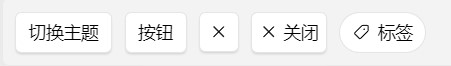
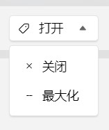
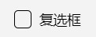
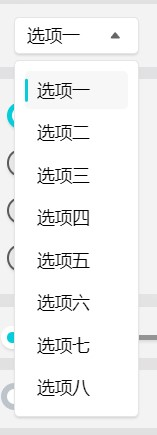
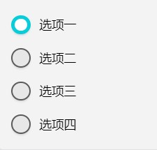
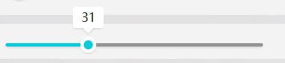
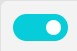
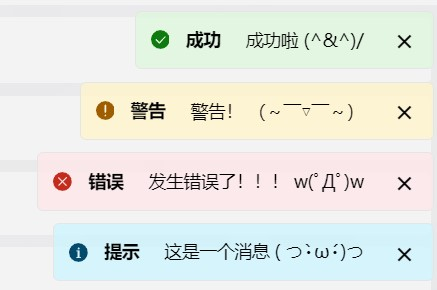
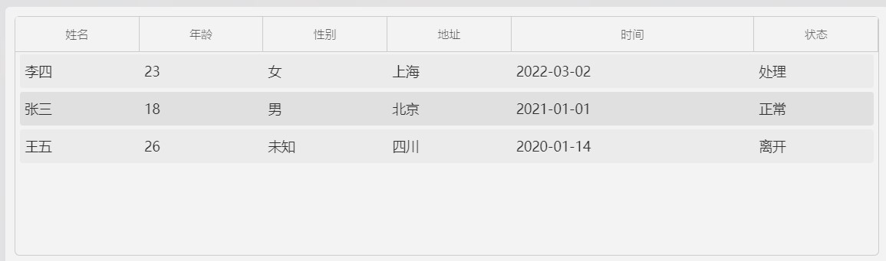
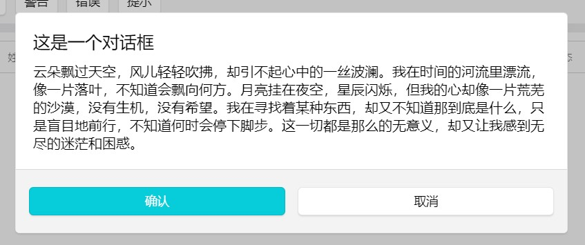

## 组件

### 按钮

> ### 文本按钮（text-button）
> #### 属性
> |属性名|说明|默认值|
> |-|-|-|
> |text|内容文本|''|
> #### 事件
> |属性名|说明|
> |-|-|
> |click|点击事件|

> ### 图标按钮（icon-button）
> #### 插槽
> |插槽名|说明|
> |-|-|
> |default|自定义内容（设置为图标即可）|
> #### 事件
> |属性名|说明|
> |-|-|
> |click|点击事件|

> ### 标签按钮（tag-button）
> #### 属性
> |属性名|说明|默认值|
> |-|-|-|
> |text|内容文本|''|
> |v-model:select|是否选中|false|
> #### 插槽
> |插槽名|说明|
> |-|-|
> |default|自定义内容（设置为图标即可）|
> #### 事件
> |属性名|说明|
> |-|-|
> |change|select改变事件|

> ### 选项按钮（select-button）
> #### 属性
> |属性名|说明|默认值|
> |-|-|-|
> |options|选项列表|[]|
> |icon|按钮图标|Object|
> |text|内容文本|''|
> |width|选项宽度|0|
> #### 事件
> |属性名|说明|
> |-|-|
> |change|select改变事件|

### 复选框

> ### 复选框（two-checkbox）
> #### 属性
> |属性名|说明|默认值|
> |-|-|-|
> |text|内容文本|''|
> |v-model:value|是否选中|false|
> #### 事件
> |属性名|说明|
> |-|-|
> |change|value改变事件|

### 选项框

> ### 选项框（text-select）
> #### 属性
> |属性名|说明|默认值|
> |-|-|-|
> |options|选项列表|[]|
> |defaultSelected|默认选中项|''|
> |width|选项宽度|0|
> #### 事件
> |属性名|说明|
> |-|-|
> |change|value改变事件|

### 单选列表

> ### 单选列表（radio）
> #### 属性
> |属性名|说明|默认值|
> |-|-|-|
> |group|选项列表|[]|
> |defaultRadio|默认选中项|''|
> #### 事件
> |属性名|说明|
> |-|-|
> |change|value改变事件|

### 滑动条

> ### 滑动条（slider）
> #### 属性
> |属性名|说明|默认值|
> |-|-|-|
> |v-model:value|滑动条值|0|
> |width|滑动条宽度|130|
> |show-tips|是否显示提示文字|true|
> #### 事件
> |属性名|说明|
> |-|-|
> |change|value改变事件|

### 开关

> ### 开关（toggle-switch）
> #### 属性
> |属性名|说明|默认值|
> |-|-|-|
> |v-model:value|状态|false|
> #### 事件
> |属性名|说明|
> |-|-|
> |change|value改变事件|

### 消息

> ### 消息（message）
> #### 属性
> |属性名|说明|默认值|
> |-|-|-|
> |title|标题|''|
> |type|消息类型|'info'|
> |text|内容文本|''|
> |isBrief|是否为短内容|true|
> |duration|显示时长|-（不会消失）|

### 表格

> ### 表格（customize-table）
> #### 属性
> |属性名|说明|默认值|
> |-|-|-|
> |header-data|表头数据|[]|
> |header-data.text|表头文本|''|
> |header-data.prop|表头属性名|''|
> |data|数据|[]|
> |height|高度|0|
> |min-width|最小宽度|0|
> |row-key|行数据的key|''|

### 对话框

> ### 对话框（customize-table）
> #### 属性
> |属性名|说明|默认值|
> |-|-|-|
> |v-model:open|是否打开|false|
> #### 插槽
> |插槽名|说明|
> |-|-|
> |body|主体内容|
> |footer|底部内容|